*Ce document est une structure de base, classique pour rédiger un cahier des charges. Elle est un peu différente de celle vue en TD. Elle n’est pas tout à fait standard non plus en couvrant davantage d’éléments qu’un cahier des charges normal (en particulier le Gantt est fait plus tard normalement, à part ses jalons)

Tout ce qui est en italique doit être remplacé. Chaque section doit contenir au moins un paragraphe. Certaines choses sont à imaginer, en se documentant un minimum pour être réaliste.*

# Cahier des charges fonctionnel - *CAS D'ETUDE*

## Entête
Groupe de TD :

|Nom | Prénom | Mail | Volume horaire estimé |
| ------ | ------ | ------ | ------ |
| *Mary* | *BASTIAN* | *BASTIAN.mary@etu.univ-nantes.fr* | 15h |
| *Danilo* | *ELOUAN* | *ELOUAN.danilo@etu.univ-nantes.fr* | 17h |
| *Moreau--Thomas* | *NILS* | *NILS.moreau--thomas@etu.univ-nantes.fr* | 17h |
| *Fremont* | *TOM* | *TOM.fremont@etu.univ-nantes.fr* | 16h |
| *Voile* | *NEIL* | *NEIL.voile@etu.univ-nantes.fr* |13h |

Date de démarrage : 12/05/2023

Version : 1.0

Destinataire : EL MAMOUNI Saïd

## 0. Petites précisions

Nous avons précisé que les membres du groupe sont chargés de la rédaction de différentes parties par le biais de l'emoji ✍️ suivi du nom des ou de la personne qui a été chargée de la rédiger. Pour chaque clause rédigé, une des personnes du groupe qui n'a pas écrit a été chargé de la correction.

## 1. Présentation générale du problème
### 1.1 Projet ✍️ NILS

De plus en plus d'adolescents sont diagnostiqués asthmatique et l'asthme est une maladie sous-diagnostiquée la plupart du temps, il arrive souvent que ces adolescents fassent des crises d'asthme inattendus. Il faut donc faire quelque chose qui permet de prévenir quand il y a un risque de crise, ou prévenir quand prendre sa ventoline pour éviter ces ladites crises et s'il n'y obéis pas, le non suivi sera notifié.

#### 1.1.1 Finalités ✍️ NEIL

Il faudrait concevoir une application qui serait capable de :

- fournir un suivi du traitement (l'administration ventoline respecté ou non)

- fournir un suivi des crises d'asthme ayant eu lieu

- fournir une prévision des crises d'asthme afin de les éviter

- fournir des conseils d'éducation thérapeuthique

#### 1.1.2 Espérance de retour sur investissement ✍️ NILS

Le retour sur investissement n'est pas le but principal de ce projet, en effet il s'agit de concevoir une application qui aide les gens, ce n'est pas un projet lucratif.

### 1.2 Contexte
#### 1.2.1 Situation du projet par rapport aux autres projets de l’entreprise ✍️ BASTIAN ELOUAN

Le projet est un sujet important qui devrait passer en priorité dans notre entreprise. Il aura des dépendances avec d'autres projets présents dans l'entreprise, comme la création d'une montre connectée qui collecte les informations du corps de la personne. Il faudra mobiliser des personnes, des moyens financiers et des équipements particuliers pour ce ledit projet. Le projet pourrait avoir un impact positif et négatif sur le déroulement interne des autres projets selon sa rentabilité.

#### 1.2.2 Études déjà effectuées ✍️ TOM ELOUAN

L'Organisation mondiale de la santé cite deux sources d'études.
Une étude réalisée par l'Organisation d'évaluation des capacités nationales de prévention et de lutte contre les maladies non transmissibles.

La seconde étude est réalisée par la Charge mondiale de 369 maladies et blessures dans 204 pays et territoires, 1990-2019

Cette étude nous donne quelque chiffre:

En 2019, on estime que 262 millions de personnes souffraient d’asthme et que cette maladie a entraîné 461 000 décès.C'est une des maladies chroniques la plus fréquente chez les enfants.

Ces études mettent en avant le fait que la probabilité de souffrir d'asthme est plus élevée si un membre de la famille en souffre. Cela marche surtout avec un membre de famille proche

l'asthme est plus fréquent chez les personnes souffrant également d'allergies.

L'urbanisation en serait aussi un facteur, cela due aux changements du mode de vie.

Un enfant naissant avec un poids de naissance faible ou avec une naissance prématurée aurait aussi tendance à augmenter la probabilité de développer cette maladie.

Une exposition au tabac ou à d'autres sources de pollution de l'air en serait une des nombreuses causes.

Une exposition régulière aux acariens, aux moisissures, aux produits chimiques, à la fumée ou même à la poussière sur les lieux de travail ou de vie augmenterait aussi la probabilité.

Une personne en surpoid a plus de chance d'être atteint d'asthme.

#### 1.2.3 Études menées sur des sujets voisins ✍️ BASTIAN

La base de données SNIIRAM (Système national d’information inter-régimes de l’assurance maladie) à menée plusieurs études sur les maladies respiratoires. Par exemple on sait qu'en 2020, on dénombre 3 607 700 personnes prises en charge pour maladies respiratoires chroniques, 1 774 800 hommes et 1 832 900 femmGarantir le respect des règles édictées par le RGPD sur les données de santé
es. Chaque année, 3 438 millions d'euros sont attribués à la prise en charge des maladies respiratoires chroniques. En France, début 2020, les maladies respiratoires causent environ 12 % des décès.
Les informations provenant de ces études ont été trouvés ici :
- [Wikipédia | Maladie respiratoire](https://fr.wikipedia.org/wiki/Maladie_respiratoire)
- [Ameli | Fiche des maladies respiratoires chroniques (hors mucovisidoes)](https://assurance-maladie.ameli.fr/sites/default/files/2020_fiche_maladies-respiratoires-chroniques-hors-mucoviscidose_0.pdf)

#### 1.2.4 Suites prévues ✍️ TOM

Notre entreprise à pour objectif d'effectuer dans le futur d'autres projets similaires, portant sur d'autres maladies chroniques comme le diabète.

#### 1.2.5 Nature des prestations demandées ✍️ ELOUAN

La nature de la prestation demandée est une application de santé permettant le suivi des personnes atteintes d'asthme. Les données recueillies (crise, suivi du traitement...) respecterons la RGPD et peuvent être sauvegardées et rétablis dans le cas échéant.

#### 1.2.6 Parties concernées par le déroulement du projet et ses résultats (demandeurs, utilisateurs) ✍️ BASTIAN

Les proches d'une personne atteinte d'asthme ainsi que le principal concerné sont les demandeurs de cette application, les utilisateurs sont les médecins, qui vont consulter les données sur notre alternative à doctissimo : doctolibre du deuxième type d'utilisateur : les personnes asthmatiques. Ces derniers vont pouvoir consulter divers informations en rapport avec leur asthme.

#### 1.2.7 Caractère confidentiel s'il y a lieu ✍️ TOM

Les données confidentielles utilisées seront l'oxymétrie, le rythme cardiaque, la température du corps. Les données concernant l'environnement ne seront pas protégées car non compromettante, cependant les données confidentielles, donc concernant personnellement l'utilisateur, seront encryptées.

### 1.3 Énoncé du besoin ✍️ ELOUAN

Le produit sera une application qui permettra d'afficher une synthèse des données recueillis aux utilisateurs. Cette synthèse de données est stockée sur un serveur  qui respecte la RGPD et où les informations personnelles sont encryptées. Cette synthèse donne lieu à une prévention pour potentielle d'une crise d'asthme ainsi que leurs suivi s' il y en a, la notification du moment où il faut administrer la prochaine ventoline et des conseils d'éducation thérapeuthique.

### 1.4 Environnement du produit recherché ✍️ NEIL

Le produit sera utilisé par les usagers mentionnés en clause 1.2.6 (utilisateurs) sera soumis à plusieurs contraintes. Tout d'abord il fonctionnera sur un téléphone, ce qui nécessite une alimentation électrique afin de recharger ledit téléphone. Ensuite l'application devra avoir à disposition le Bluetooth, le GPS et le réseau. Le Bluetooth pour que la montre connecté puisse communiquer les informations environnementales, le GPS pour la même raison afin de récupérer des données météorologiques via internet. De plus, le GPS permettra de signaler le lieu où a eu lieu une crise d'asthme. Et enfin le réseau sera nécessaire afin de transmettre l'ensemble des données vers une sauvegarde cloud et vers le personnel médical.
L'application sera aussi en communication avec un autre de nos projet : Doctolibre plus regardante sur la vie privé des utilisateurs.

#### 1.4.1 Listes exhaustives des éléments *(personnes, équipements, matières…)* et contraintes ✍️ NEIL NILS

Les personnes concerné par le projet seront les personnes asthmatiques ainsi que le personnel médical
Ce personnes asthmatiques utilisent plusieurs équipements:

- une montre connecté qui va recueillir le rythme cardiaque, la respiration, l'activité physique et le taux d'oxygène dans le sang

- des capteurs qui recueille des données environnementales qui s'attache sur une bretelle de sac à dos

- des questionnaires via l'application pour avoir le ressenti post-crise

- un bronchodilatateur connecté ainsi qu'un spiromètre connecté afin de recueillir des données sur le suivi du traitement

Ces données recueillis seront dans plusieurs catégories :

- Les données comportementale qui comprend les données sur l'activité physique, le suivi du traitement et ressenti post-crise

- Les données physiologiques qui comprend les données sur le rythme cardiaque, la respiration et le taux d'oxygène dans le sang

- Les données environnementales qui comprend les données sur le taux d’humidité, le taux de COVs atmosphérique (concentration en COVs), le taux de CO2 atmosphérique (concentration en CO2) et taux d’O3 atmosphérique (concentration en ozone)

#### 1.4.2 Caractéristiques pour chaque élément de l’environnement (demander au prof) ✍️ ELOUAN

- Les données physiologiques sont recueillies par la montre, qui fonctionne sous batterie (donc alimentation électrique) et qui utilise le Bluetooth pour communiquer ses données à l'application via le téléphone.
- Les données environnementales sont recueillies par des capteurs placés sur une bretelle du sac à dos ainsi que par le biais d'internet et du GPS du téléphone pour récupérer des informations météorologiques supplémentaires, qui fonctionne sous batterie placée dans le sac et qui utilise le Bluetooth pour communiquer ses données à l'application via le téléphone.
- Les données comportementales sont recueillies avec des questionnaires via l'application.
- Toutes ces données sont envoyées sur un serveur de Doctolibre dont le médecin aura accès. Le patient à la possibilité de supprimer ces données présentes sur le serveur, par ailleurs le respect de la RGPD garantit la suppression au bout de 3 ans de stockage.  

## 2. Expression fonctionnelle du besoin ✍️ BASTIAN NILS

### __Diagramme de cas d’utilisation de chaque fonction__

| | | |
|:-------------------------:|:-------------------------:|:-------------------------:|
|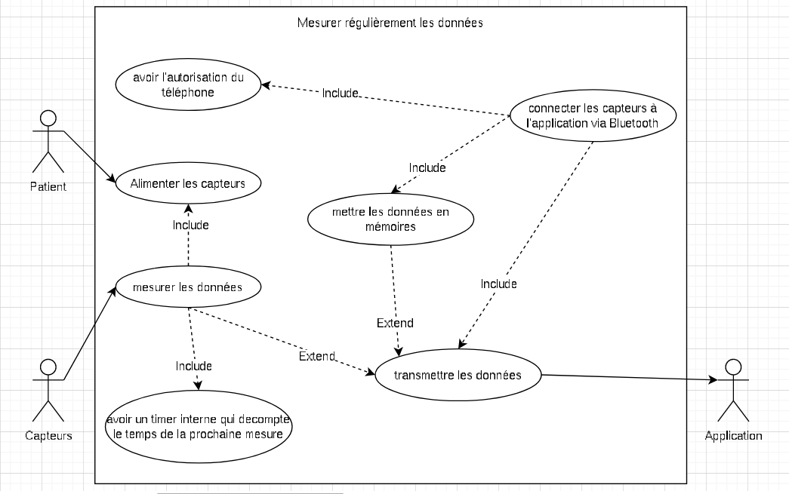|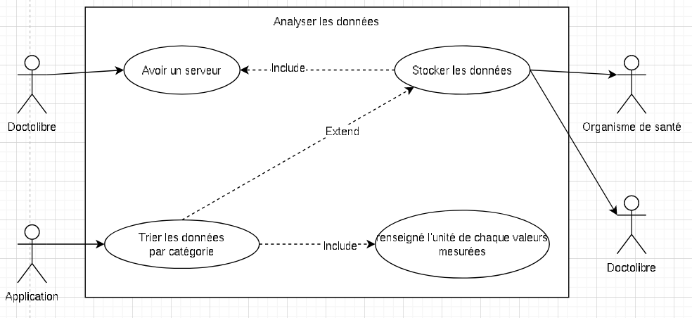|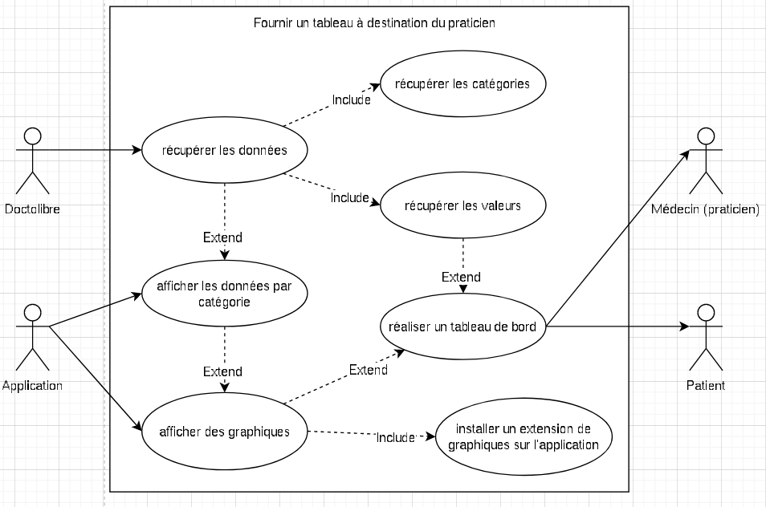|
|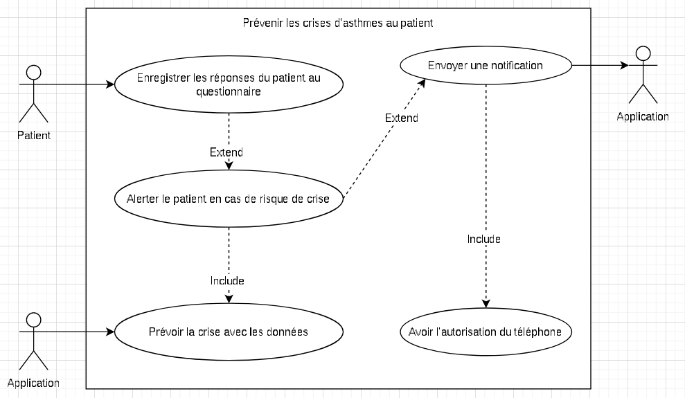|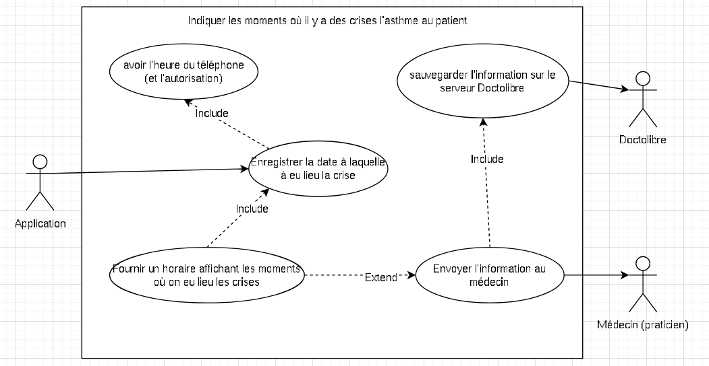|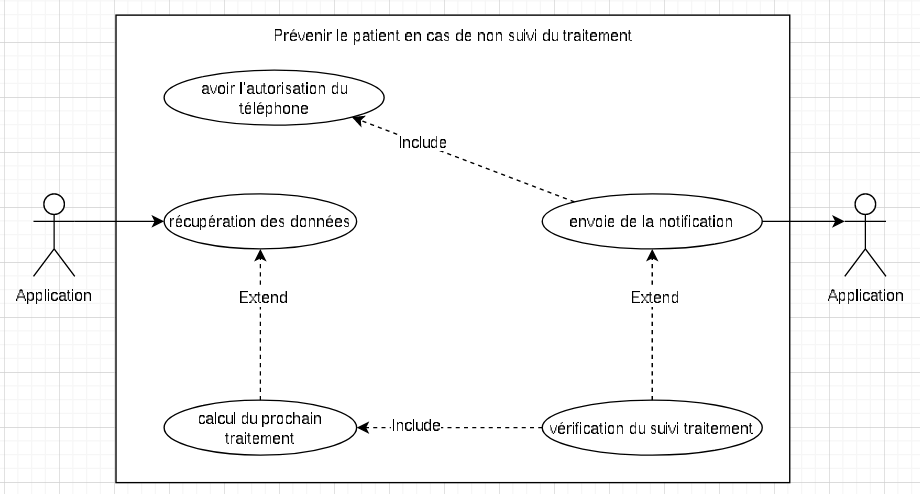|
|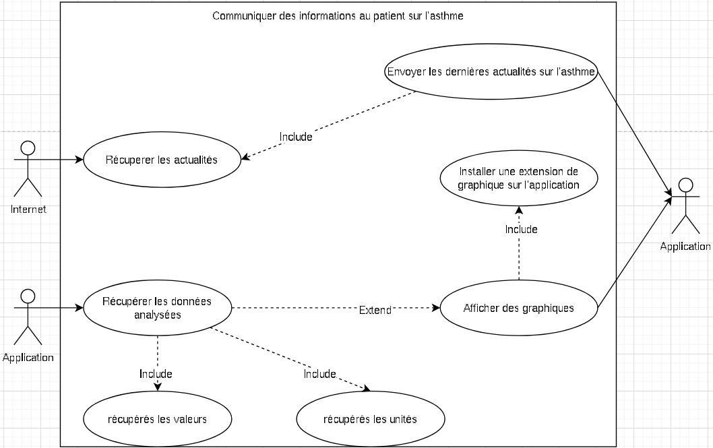|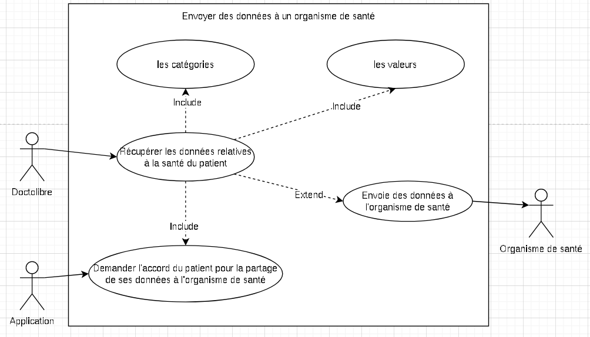|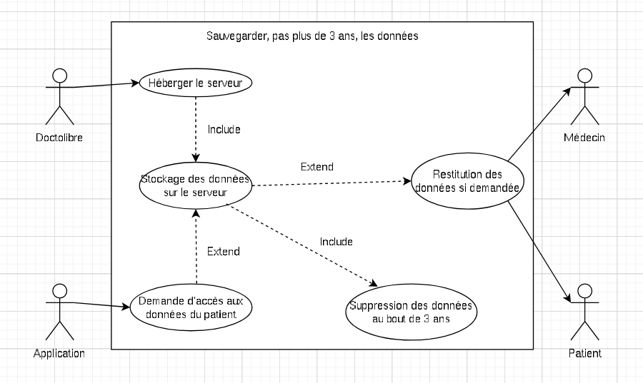|

### __Classement des fonctions__

| Nom de la fonction | coefficient de pondération (1-5) | critère d’appréciation (comment qu'on est satisfait) | niveau d’un critère d’appréciation | niveau de flexibilité |
| ------ | ------ | ------ | ------ | ------ |
| mesurer les données régulièrement | 5 | doit rendre un résultat toutes les minutes | un résultat de 55s à 65s est acceptable | 100% dans l'intervalle, 0% au delà |
| analyser les données | 5 | doit rendre un résultat sans la moindre erreur | un résultat qui est délivré en 5s est acceptable | 100% dans l'intervalle, 0% au delà |
| fournir un tableau de bord à destination du praticien | 4 | doit mettre à disposition l'ensemble des données concernant l'asthme du patient sans aucune erreur et perte d'information | une actualisation entre 5 et 10s après qu'une donnée change | 85% dans l'intervalle, 15% en dessous de 5s et 0% au delà de 10s |
| prévenir les crise d'asthme au patient | 5 | doit prévenir 1 secondes après la prédilection et de manière visible (avec le vibreur, le son et la notification) | une prévention de 0.1s à 1s est acceptable | 100% dans l'intervalle, 0% au delà |
| indiquer les moments ou il ya eu une crise d'asthme au praticien et au patient | 3 | capable d'indiquer le moment exacte de chaques crises d'asthme (heure,minute,seconde) | un résultat qui s'écarte de 59s est acceptable | 75% dans l'intervalle, 15% au delà de 5s |
| prévenir le patient en cas de non suivi du traitement | 5 | doit prévenir maximum 5 secondes après la détection du non-suivi (notification) | un résultat rendu en 5s ou moins est acceptable | 100% dans l'intervalle, 0% au delà |
| communiquer des informations au patient sur l'asthme | 2 | doit rendre un résultat sans la moindre erreur, compréhensible par tous, et utile | un résultat qui est transmis en 1 minutes ou moins est acceptable | 50% dans l'intervalle, 50% au delà de 10s |
| envoyer des données à l'Espace Numérique de Santé | 4 | les données sont intégralement envoyé sans la moindre information manquante à la réception | les données qui sont transmisent en 1 minutes ou moins est acceptable | 85% dans l'intervalle, 15% au delà de 2.5s |
| sauvegarder sur Doctolibre, pas plus de 3 ans (*3 ans car on respecte la RGPD*), les données | 4 | les données sont intégralement sauvegardées et capables d'être restituées. Aux bout de 3 ans les données sauvegardées non chargés doivent être supprimé dans leur intégralité | les données qui sont supprimé après 3 ans, à 23h59 près est acceptable | 100% dans l'intervalle, 0% au delà |

### __Tableau fonctionnel__

| Fonction | Critère | Niveaux | Flexibilité |
| ------ | ------ | ------ | ------ |
| FC1 : mesurer les données régulièrement | Efficacité,Quantitativité | Physique | F0 |
| FP1 : analyser les données | Informatif | Calculatoir | F0 |
| FP2 : fournir un tableau de bord à destination du praticien | Informatif | Patient,praticien | F1 |
| FP3 : prévenir les crise d'asthme au patient | Informatif | Patient | F0 |
| FP4 : indiquer les moments ou il ya eu une crise d'asthme au patient | Santé,Respiratoire | Patient,praticien | F1 |
| FP5 : prévenir le patient en cas de non suivi du traitement | Santé,Informatif | Santé,Visuel | F0 |
| FP6 : communiquer des informations au patient sur l'asthme | Efficacité, Clarté | Patient | F2 |
| FP7 : envoyer des données à un organisme de santé (*exemple : Espace Numérique de Santé*) | Informatif,Sécurité | Numérique,Sécurité | F1 |
| FC2 : sauvegarder sur Doctolibre, pas plus de 3 ans (*3 ans car on respecte la RGPD*), les données | Sécurité,Préservation | Serveur de Doctolibre | F0 |

### 2.1 Fonctions de service et de contrainte
#### 2.1.1 Fonctions de service principales
##### 2.1.1.1 Description et détail ✍️ NILS BASTIAN

Le produit a pour but d'apporter une aide et un suivi médical simple d'utilisation tout en restant complet. Le suivi et l'aide concerne une maladie, qui est sous-traitée, se nommant l'asthme.
Pour plus de précisions sur le produit veuillez vous reférer à la clause 1.3

L'application aura un tableau de bord qui intégrera des graphiques sur l'évolution des son asthme (respiration,battement de coeur etc...) et un calendrier qui aura le suivi du traitement, les différentes crises d'asthme ayant eu lieu, les jours jugées dangereux pour la personne asthmatique et les rendez vous chez le médecin en rapport avec l'asthme. L'application va devoir effectuer des calculs, comme sur le rythme respiratoire et sa corrélation avec la qualité de l'air et le flux sanguin.
l'application aura un visuel minimaliste et colorée pour attiré l'oeil sur les informations importantes. L'application va faire vibrer le téléphone en cas de crise, si c'est le moment de prendre une ventoline et s'il y a un risque de crise.
L'application sera aussi maintenue pour être compatible avec le plus d'appareils possibles et la plus performante possible. Par ailleurs, le serveur stockant les données sera maintenu en bon état afin de rester opérationnel. Cette application a aussi des contraintes de fonctionnement, précisées à la clause 1.4.

##### 2.1.1.2 Critères d’appréciation et les niveaux qui les caractérisent ✍️ BASTIAN

- FP1 -> Quant à l'analyse des données le critère d'appréciation est aussi imposé et n'est pas flexible car les qualités des analyses se doivent d'être exacte impérativement et ne pas conclure des diagnostics erronés.

- FP2 -> Pour fournir un tableau de bord à destination du praticien pour un accès aux données du patient les données doivent s'actualiser entre 5 et 10 seconde après qu'un changement s'est produit pour ne pas surcharger les capacité de l'application mais peut etre flexible à hauteur de 15% en dessous de l'intervalle car ca ne suffirait pas pour être véritablement dérangeant pour le logiciel.

- FP3 -> Prévenir les crise d'asthme au patient est très important et non flexible le critère d'appréciation qui doit prévenir 1 secondes après la prédilection et de manière visible (avec le vibreur, le son et la notification) et pour le niveaux qui les caractérisent qui est une prévention de 0.1s à 1s est acceptable.

- FP4 -> Indiquer les moments ou il ya eu une crise d'asthme au praticien et au patient est important mais il peut être flexible jusqu'à 85% soit 5s de délai. Le critères d'appréciation est capable d'indiquer le moment exact de chaque crise d'asthme (heure,minute,seconde). Pour le niveau qui les caractérise est un résultat qui s'écarte de 59s est acceptable.

- FP5 -> Prévenir le patient en cas de non suivi du traitement n'est pas flexible. Le critère d'appréciation doit prévenir maximum 5 secondes après la détection du non-suivi avec une notification. Le niveau qui les caractérise est un résultat donné en 5s ou moins. C'est aussi une fonction très importante qui ne peut être flexible car vitale pour le patient.

- FP6 -> Communiquer des informations au patient sur l'asthme est aussi une fonction importante mais elle peut être flexible de 50% soit un délai de 10 secondes maximum. Le critère d'appréciation doit rendre un résultat sans la moindre erreur. Le niveau qui les caractérise doit être compréhensible par tous, et utile un résultat qui est transmis en 1 minutes ou moins est acceptable.

- FP7 -> envoyer des données à un organisme de santé (*exemple : Espace Numérique de Santé*). Le critère d'appréciation de cette fonction, est imposé, important et non flexible, les données doivent être envoyées sans information manquante, l'envoi d'information doit se faire en moins d'une minute.

#### 2.1.2 Fonctions de service complémentaires ✍️ BASTIAN NILS

La mesure des données va compléter l'application, ces données sont mentionnées clause 1.4.
Cette fonction est divisé en trois sous-fonctions, chacun d'elle pour un type de données :

- Environnementale
- Comportementale
- Physiologique
Puis ces sous-fonctions seront scindés sur les données mesurées par les différents appareils.

Nous aurons également le langage de programmation utilisé par l'application qui sera externe étant données que nous n'iront pas créé notre propre langage, de même pour le rendu visuelle qui utilisera un moteur de rendu 2D (comme Unity par exemple).

##### 2.1.2.1 Description et détail ✍️ NILS

Les fonctions extérieures ont pour but de rendre l'application fonctionnelle. Soit l'acquisition des données pour notre projet et le stockage sur nos serveurs. Les capteurs vont permettre cette acquisition, mais avant tout il va falloir les acquérir et réaliser leurs programmes de lecture et de transfert des données. Le seul calcul à faire sera la mesure en respectant l'intervalle cité dans le tableau (clause 2). Ces capteurs seront dans un produit séparé, qui sera sous la forme d'un boîtier rechargeable qui se fixe sur une bretelle de sac à dos. Les contraintes de fonctionnement sur ces capteurs sont énoncés clause 1.4. Pour ce qui est des serveurs, ils doivent être alimenté en électricité et aussi capable de recevoir et émettre des informations sur Internet, il va donc falloir réaliser leurs infrastructures.

##### 2.1.2.2 Critères d’appréciation et les niveaux qui les caractérisent ✍️ ELOUAN BASTIAN

- Pour la fonction de mesure régulière des données, le critère d'appréciation est imposé et ne peut être déplacé. Il n'est absolument pas flexible, car il est extrêmement important pour le bon suivi de la maladie d'avoir des prises d'informations fiables à intervalles réguliers. Si le logiciel rencontrait des problèmes pour collecter les données du patient et ne pouvait pas le prévenir d'une crise, cela serait très critique, tout comme un manque d'analyse météorologique, par exemple.

- Pour la fonction de sauvegarde des données sur Doctolibre, les données sont conservées pendant une période maximale de 3 ans (respectant la RGPD) avant d'être supprimées. Le critère d'appréciation de la fonction de sauvegarde des données est imposé, important et non flexible. Les données sont sauvegardées puis supprimées au bout de 3 ans, avec une marge maximale d'un jour.

*(Niveaux souhaités mais révisables)*
#### 2.1.3 Contraintes ✍️ NILS BASTIAN
L'équipement extérieur à l'application (mentionné clause 1.4.1) doit être capable de transmettre des informations et donc d'avoir le Bluetooth et d'être capable de se connecter au téléphone pour transmettre leurs données à l'application. Cet équipement est aussi électrique il faut donc une alimentation afin de recharger les objets connectés.

## 3. Cadre de réponse ✍️ TOM ELOUAN 

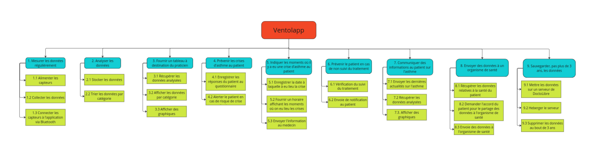

### 3.1 Mesurer les données régulièrement
#### 3.1.1 Solution proposée ✍️ TOM ELOUAN NILS 
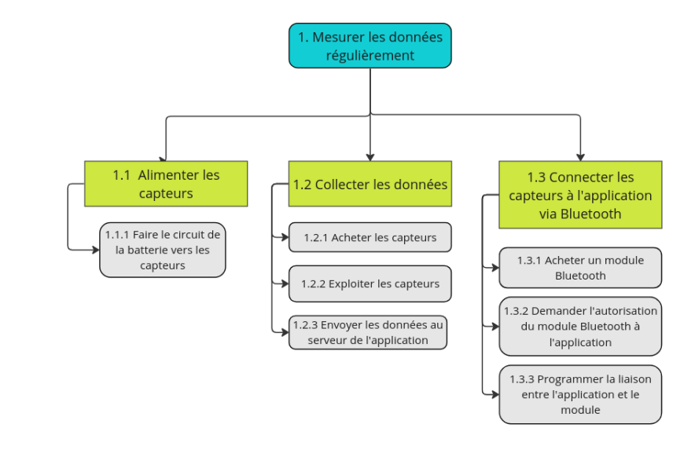

Scénario nominal : La mesure de données se passe bien.
Scénario alternatif : Pas de données à mesurer.
Scénario exceptionnel : Erreur lors de la mesure des données.

La fonction 3.1(Mesurer les données régulièrement)
Cette fonction doit être réalisée en environ 25 jours.
Donc commencement le 01/06/2023 et fin le 26/06/2023
Nous avons choisi ce temps car il nous semble adapté. En effet les seules tâches de cette fonction qui semble être longue sont le fait de programmer la liaison entre l'application et le module et le fait d'envoyer les données au serveur de l'application.

#### 3.1.2 Niveau atteint pour chaque critère d’appréciation de cette fonction et modalités de contrôle ✍️ NEIL

| Fonction | Critère D’appréciation | Niveaux | Modalités de Contrôle |
| ------ | ------ | ------ | ------ |
| Alimenter les capteurs | Fiabilité de l'alimentation des capteurs | 5 | Tests de longue durée sous des conditions opérationnelles réelles |
| Collecter les données | Intégrité des données collectées | 5 | Tests effectués sur les capteurs sur une longué durée |
| Connecter les capteurs à l'application via Bluetooth | Fiabilité de la connexion Bluetooth | 4 | Tests en simulant des conditions d'utilisation normales sur la stabilité |

#### 3.1.3 Part du prix attribué à chaque fonction ✍️ BASTIAN 

| Objet / Service | Prix |
| ------ | ------ |
| Capteur Oxymétrie | 10€ | 
| Capteur Rythme cardiaque| 3€ | 
| Capteur Température corporelle | 8€ |  
| Capteur Taux d’humidité & Température ambiante | 3€ | 
| Capteur Taux de COVs & de CO2 & d’O3 atmosphérique | 50€ |  
| Module bluetooth | 1€ | 
| Schéma circuit imprimer | 3€ |  

---
### 3.2 Analyser les données
#### 3.2.1 Solution proposée ✍️ TOM ELOUAN NILS
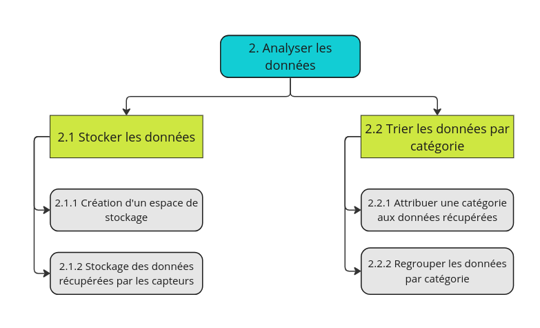

Scénario nominal : Les données sont analysées.
Scénario alternatif : Pas de données à analyser.
Scénario exceptionnel : Erreur lors de l'analyse.

La fonction 3.2(Analyser les données)
Cette fonction doit être réalisée en environ 20 jours.
Donc commencement le 26/06/2023 et fin le 15/07/2023
ici le temps choisi peut varier en fonction du temps mis pour créer un trie efficace de données.Ici nous pensons donc que 15 jours sera suffisant pour créer une bonne analyse de données.

#### 3.2.2 Niveau atteint pour chaque critère d’appréciation de cette fonction et modalités de contrôle ✍️ NEIL

| Fonction | Critère D’appréciation | Niveaux | Modalités de Contrôle |
| ------ | ------ | ------ | ------ |
| Stocker les données | Données stocker sans perte  | 5 |Envoie massif de données |
| Trier les données par catégorie | Trie des donnée structurée et efficace | 5 | Envoie massif de donnée| 

#### 3.2.3 Part du prix attribué à chaque fonction ✍️ BASTIAN 

| Objet / Service | Prix |
| ------ | ------ |
| Développeur SQL (salaire debutant a 2 500 € / mois) | 17,85€/h * 98 = 1750€ |

--
### 3.3 Fournir un tableau à destination du patient.
#### 3.3.1 Solution proposée ✍️ TOM BASTIAN NILS
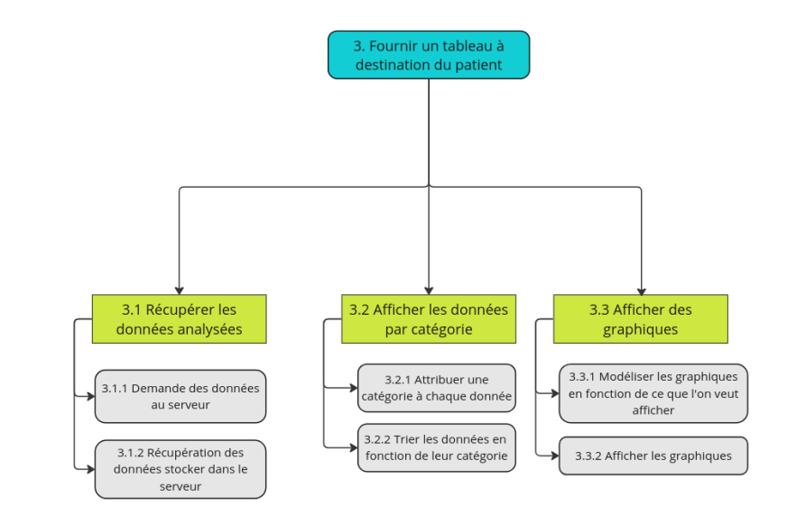

Scénario nominal : Affichage d'un tableau avec des données exactes.
Scénario alternatif : Données avec écarts.
Scénario exceptionnel : Erreur lors de l'affichage.

La fonction 3.3(Fournir un tableau à destination du patient)
Cette fonction doit être réalisée en environ 20 jours.
Donc commencement le 15/07/2023 et fin le 04/08/2023
Ici nous pensons donc que 20 jours sera suffisant car la tâche la plus dure est de modéliser les graphique.

#### 3.3.2 Niveau atteint pour chaque critère d’appréciation de cette fonction et modalités de contrôle ✍️ NEIL

| Fonction | Critère D’appréciation | Niveaux | Modalités de Contrôle |
| ------ | ------ | ------ | ------ |
| Récupérer les données analyses | Temps de récupération des données | 3 | Tests le temps nécessaire pour récupérer les données d'analyses |
| Afficher les données par catégorie | Pertinence de l'affichage des données par catégorie | 5 | Tests tests utilisateurs pour évaluer la facilité de navigation et la pertinence |
| Afficher des graphiques | Lisibilité et compréhension des graphiques | 4 | Recueillant les avis des utilisateurs |

#### 3.3.3 Part du prix attribué à chaque fonction ✍️ ELOUAN

| Objet / Service | Prix |
| ------ | ------ |
| Développeur Kotlin | 24.18€/h * 89 = 2370€ | 

---
### 3.4 Prévenir les crises d'asthme au patient
#### 3.4.1 Solution proposée ✍️ TOM ELOUAN NILS

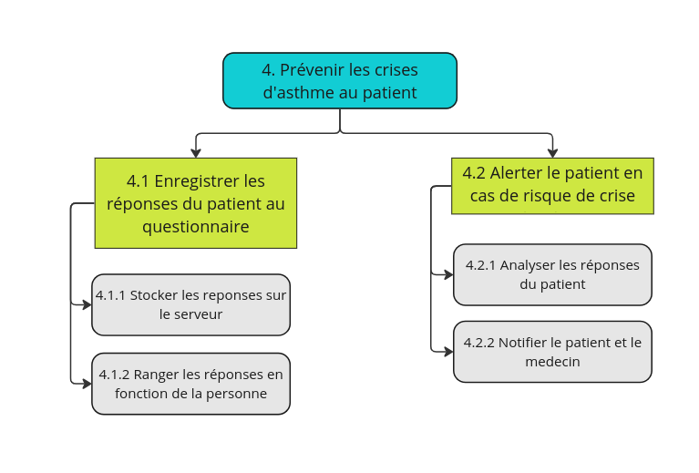

Scénario nominal : Les crises d'asthme sont prévenues.
Scénario alternatif : Pas de crises d'asthme à prévenir.
Scénario exceptionnel : Erreur lors de la prévention.

La fonction 3.4(Prévenir les crises d'asthme au patient)
Cette fonction doit être réalisée en environ 40 jours.
Donc commencement le 04/08/2023 et fin le 13/09/2023
Ici nous pensons donc que 40 jours devrait suffire.cette fonction est très importante car plus l'analyse des réponses du patient sera bien programmé plus l'alerte et le suivi seront pertinentes. 

#### 3.4.2 Niveau atteint pour chaque critère d’appréciation de cette fonction et modalités de contrôle✍️NEIL

| Fonction | Critère D’appréciation | Niveaux | Modalités de Contrôle |
| ------ | ------ | ------ | ------ |
| Enregistrer les réponses du patient au questionnaire | donnée du questionnaire bien enregistrée sans perte | 5 |Envoie massif de réponse de questionnaire |
| Alerter le patient en cas de risque de crise | Bon envoie de l'alerte  | 5 | Alerté dès faut utilisateur en masse pour vérification du bon fonctionnement des alertes|

#### 3.4.3 Part du prix attribué à chaque fonction✍️ELOUAN 

| Objet / Service | Prix |
| ------ | ------ |
| Développeur Kotlin | 24.18€/h * 100 = 2420€ | 
| Développeur SQL | 17.85/h * 96 = 1710€ | 

---
### 3.5 Indiquer les moments où il y a eu une crise d'asthme au patient
#### 3.5.1 Solution proposée✍️TOM BASTIAN NILS

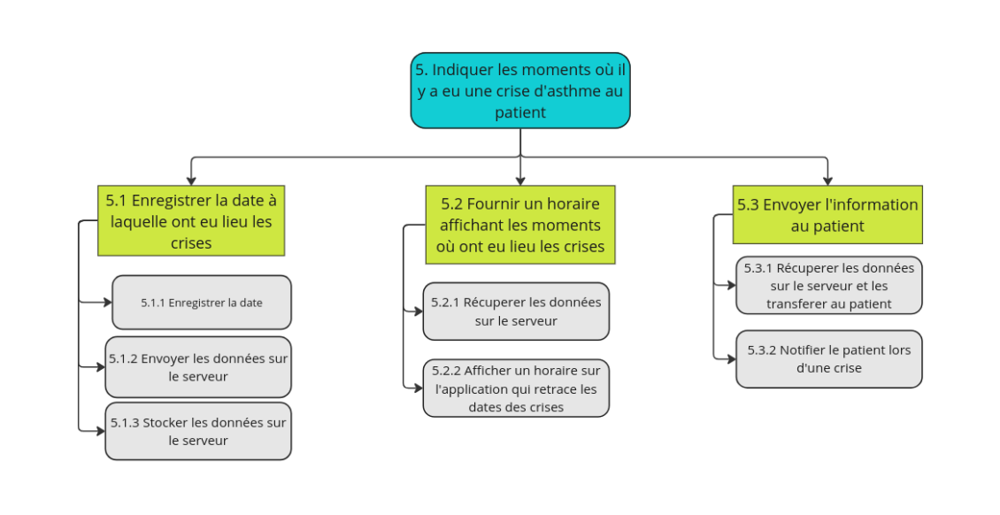

Scénario nominal : Affichage d'un horaire répertoriant les crises d'asthme que le patient à subit.
Scénario alternatif : Pas de crises d'asthme passées donc pas d'horaire à afficher.
Scénario exceptionnel : Erreur lors de l'affichage de l'horaire.

La fonction 3.5(Indiquer les moments ou il y a eu une crise d'asthme au patient)
Cette fonction doit être réalisée en environ 20 jours.
Donc commencement le 13/09/2023 et fin le 03/10/2023
Ici les tache sont assez similaire à celle déjà réalisée au préalable, alors nous pensons il ne faudrait pas plus de 15 jours.

#### 3.5.2 Niveau atteint pour chaque critère d’appréciation de cette fonction et modalités de contrôle✍️NEIL

| Fonction | Critère D’appréciation | Niveaux | Modalités de Contrôle |
| ------ | ------ | ------ | ------ |
|Enregistrer la date à laquelle ont eu lieu les crises| bon enregistrement de la date sans erreur test | 5 | test de rentrer plusieur date pour vérifier |
| Fournir un horaire affichant les moments ou ont eu lieu les crises | Bon horaire fournie | 3 | envoie d'horaire pour | vérifier |
| Envoyer l'information au patient | Bonne information envoyer au patient | 5 | envoie massif d'info pour vérification |

#### 3.5.3 Part du prix attribué à chaque fonction✍️ BASTIAN 

| Objet / Service | Prix |
| ------ | ------ |
|Développeur Kotlin | 24.18€/h * 60 = 1450€|
| Développeur SQL | 17.85€/h * 38 = 680€ |
---
 * ### 3.6 Prévenir le praticien et le patient en cas de non suivi du traitement
#### 3.6.1 Solution proposée✍️TOM ELOUAN NILS

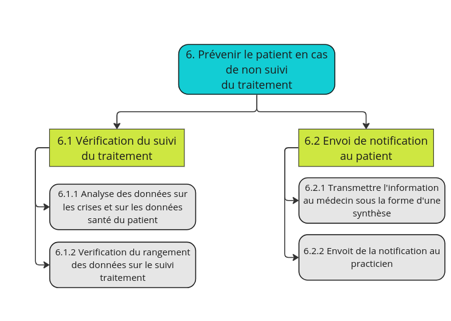

Scénario nominal : Le patient ne suit pas son traitement, il faut envoyer une notification.
Scénario alternatif : La notification est envoyée en retard.
Scénario exceptionnel : La notification n'est pas envoyée.

La fonction 3.6(Prévenir le praticien et le patient en cas de non suivi du traitement)
Cette fonction doit être réalisée en environ 30 jours.
Donc commencement le 03/10/2023 et fin le 03/11/2023

#### 3.6.2 Niveau atteint pour chaque critère d’appréciation de cette fonction et modalités de contrôle ✍️NEIL

| Fonction | Critère D’appréciation | Niveaux | Modalités de Contrôle |
| ------ | ------ | ------ | ------ |
|Vérification du suivi du traitement| bonne vérification | 5 | envoie de donnée massive |
| Envoi de notification au praticien | bonne transmission des donnée sans perte | 4 | Test en envoyant massivement des données | 

#### 3.6.3 Part du prix attribué à chaque fonction✍️ BASTIAN
| Objet / Service | Prix |
| ------ | ------ |
| Développeur Kotlin | 24.18€/h * 20 = 507€|

---
### 3.7 Communiquer des informations au patient sur l'asthme
#### 3.7.1 Solution proposée✍️TOM ELOUAN
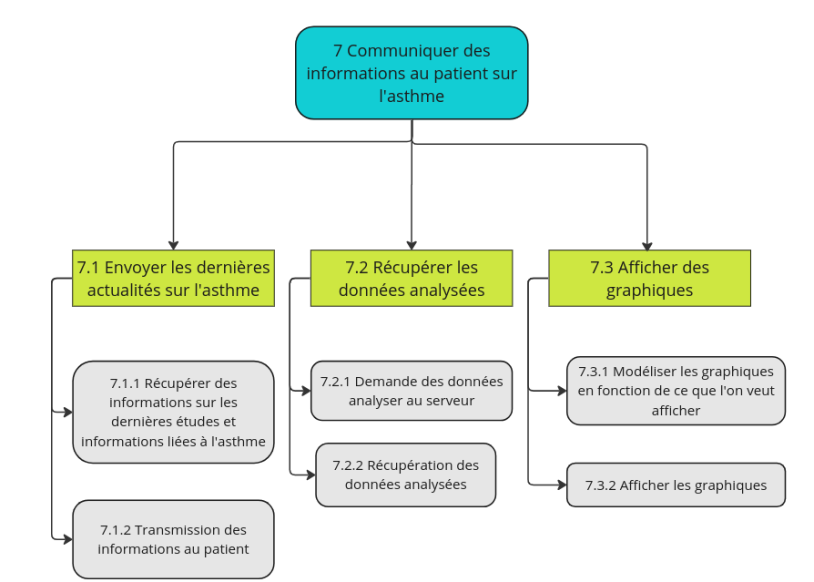

Scénario nominal : Communication des informations au patient.
Scénario alternatif : Communication des informations avec un délai de moins d'une minute.
Scénario exceptionnel : Communication des informations avec un délai important.

La fonction 3.7(Communiquer des informations au patient sur l'asthme)
Cette fonction doit être réalisée en environ 15 jours.
Donc commencement le 03/11/2023 et fin le 18/11/2023
Ici les tâches sont encore une fois semblables aux tâches faites au préalable. Donc 15 jours nous semble suffisant

#### 3.7.2 Niveau atteint pour chaque critère d’appréciation de cette fonction et modalités de contrôle✍️NEIL

| Fonction | Critère D’appréciation | Niveaux | Modalités de Contrôle |
| ------ | ------ | ------ | ------ |
|Envoyer les dernières actualités| bonne vérification | 5 | envoie de donnée massive |
| Récupérer les données analysée | bonne transmission des donnée sans perte | 4 | Test en envoyant massivement des données | 
| Afficher des graphiques | Lisibilité et compréhension des graphiques | 4 | Recueillant les avis des utilisateurs |

#### 3.7.3 Part du prix attribué à chaque fonction✍️ELOUAN

| Objet / Service | Prix |
| ------ | ------ |
| Développeur Kotlin | 24.18€/h * 50 = 1210|
| Développeur SQL | 18.85€/h * 27 = 506€|

#### 3.8.1 Solution proposée✍️TOM ELOUAN Niel
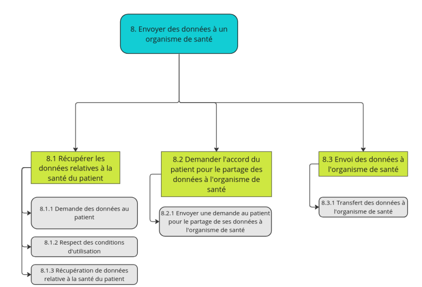

Scénario nominal : Les données sont envoyées en intégralité
Scénario alternatif : Les données sont envoyées avec un délais de 7.5s
Scénario exceptionnel : Les données ne sont pas envoyées

La fonction 3.9(Envoyer des données à un organisme de santé)
Cette fonction doit être réalisée en environ 10 jours.
Donc commencement le 18/11/2023 et fin le 28/11/2023
Les tâches nous semblant assez simple ici nous pensons que cela serait réalisable en une dizaine de jour.

#### 3.8.2 Niveau atteint pour chaque critère d’appréciation de cette fonction et modalités de contrôle✍️ BASTIAN

| Fonction | Critère D’appréciation | Niveaux | Modalités de Contrôle |
| ------ | ------ | ------ | ------ |
|Récupérer les données relatives à la santé du patient| Données récupérer sans perte | 4 | prise de donnée de masse pour vérification |
| Demander l'accord du patient pour le partage des données a l'organisme de santé | demande correctement envoyer | 2 | Test pour la demende | 
| Envoi des données a l'organisme de santé | Bonne envoie des données | 4 | Test d'envoie de données a l'organisme

#### 3.8.3 Part du prix attribué à chaque fonction✍️ BASTIAN

| Objet / Service | Prix |
| ------ | ------ |
| Développeur Kotlin | 24.18€/h * 50 = 1210|
| Développeur SQL | 18.75€/h * 27 = 506€|

---
### 3.9 Sauvegarder, pas plus de 3 ans, les données
#### 3.9.1 Solution proposée✍️TOM BASTIAN NILS
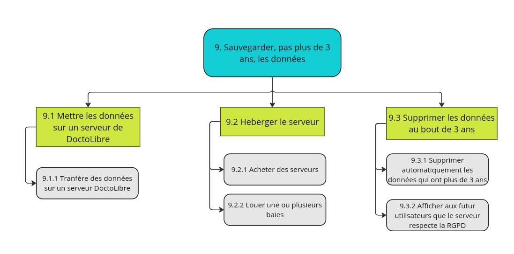

Scénario nominal : Suppression des données en temps voulu.
Scénario alternatif : Retard de 24h sur la suppression des données.
Scénario exceptionnel : Non-suppression des données.

La fonction 3.9(Sauvegarder, pas plus de 3 ans, les données)
Cette fonction doit être réalisée en environ 40 jours.
Donc commencement le 18/11/2023 et fin le 28/01/2024
Les tâches concernant cette fonction sont des tâches qui peuvent prendre du temps donc 40 jours devrait être nécessaire.

Pour respecter le Règlement général sur la protection des données.

#### 3.9.2 Niveau atteint pour chaque critère d’appréciation de cette fonction et modalités de contrôle✍️NEIL

| Fonction | Critère D’appréciation | Niveaux | Modalités de Contrôle |
| ------ | ------ | ------ | ------ |
|Mettre les données sur un serveur de Doctolibre| Mise des données sans perte| 3 | Envoie de données pour test|
| Héberger le serveur | Serveur correcte et fonctionnelle | 3 |Test du bon fonctionnement du serveur|
|  Supprimer les données au bout de 3 ans | Mises à jours du temps de vie des données | 5 | Mettre des données et faire comme si la donnée avait été envoyé depuis 2,99 années

#### 3.9.3 Part du prix attribué à chaque fonction✍️ELOUAN

| Objet / Service | Prix |
| ------ | ------ |
| Acheter Serveur | 400€ (occasion) |
| Location baie | payer par l'état |
| Développeur infrastructure réseau | 24.73 * 113 = 2794€ |
| Développeur SQL | 18.85€/h * 27 = 506€|

---
### 3.10 Pour l’ensemble du produit
#### 3.10.1 Prix de la réalisation de la version de base✍️NEIL TOM
*Ici, il faut imaginer en faisant une petite étude de marchée (cf des sites marchands spécialisés)*

Étude de marché : Application mobile pour le suivi et la prévention de l'asthme

Analyse du marché de l'asthme :
L'asthme est une maladie courante touchant des millions de personnes dans le monde, avec une prévalence croissante, en particulier chez les enfants et les adolescents. En France, l'asthme affecte 3,5 millions de personnes, dont environ 1,2 million sont des enfants et des adolescents. Ces chiffres indiquent une demande potentielle significative pour une application mobile visant à améliorer la gestion de l'asthme.

Analyse des besoins des patients :
Les patients asthmatiques ont besoin d'un moyen pratique et efficace pour suivre leur état de santé, prévenir les crises d'asthme et gérer leur traitement. Ils souhaitent également avoir des informations personnalisées et des conseils adaptés à leur situation spécifique. Une application mobile peut répondre à ces besoins en offrant un suivi régulier, des rappels pour la prise de médicaments, des conseils sur l'environnement et le mode de vie, et en permettant aux utilisateurs de signaler les symptômes et déclencheurs de leurs crises.

Analyse des concurrents :
Il existe quelques applications mobiles axées sur la gestion de l'asthme disponibles sur le marché, mais la plupart se concentrent sur des fonctionnalités basiques telles que la tenue d'un journal des symptômes ou la gestion des médicaments. Une application qui propose une approche multi-factorielle en intégrant des capteurs IoT, des questionnaires et des algorithmes prédictifs basés sur l'IA aurait un avantage concurrentiel distinct. Cependant, il est essentiel d'analyser les caractéristiques, la portée et la qualité des applications concurrentes existantes pour identifier les opportunités de différenciation.

Analyse du potentiel commercial :
L'application mobile proposée peut cibler à la fois les patients asthmatiques et les professionnels de la santé qui les traitent. En offrant un suivi précis, des conseils personnalisés et une meilleure compréhension des facteurs déclenchants de l'asthme, l'application peut contribuer à améliorer l'observance du traitement et la qualité de vie des patients. Elle peut également fournir des informations utiles aux praticiens pour un suivi plus précis et un diagnostic amélioré. Pour évaluer le potentiel commercial, il est important d'estimer la taille du marché, d'identifier les canaux de distribution appropriés et d'analyser le modèle économique, notamment les revenus issus des téléchargements, des publicités ou des abonnements.

Analyse des réglementations et des politiques de santé :
Il est essentiel de comprendre les réglementations et les politiques de santé en vigueur dans le pays cible pour s'assurer que l'application est conforme aux normes de sécurité et de protection des données. Des réglementations telles que le Règlement général sur la protection des données (RGPD) de l'Union européenne doivent être prises en compte lors du développement de l'application et de la collecte des données médicales des utilisateurs.

Conclusion :

L'élaboration d'une application mobile pour le suivi et la prévention de l'asthme offre des opportunités

Cette étude a été réalisé grâce à l'application ChatGPT

#### 3.10.2 Options et variantes proposées non retenues au cahier des charges✍️NEIL

Une option réglable pour pouvoir choisir des personnes a qui est envoyer une notification en cas de crise(en plus du docteur et du patient).Pourrait servir à prévenir les parents par exemple.

#### 3.10.3 Mesures prises pour respecter les contraintes et leurs conséquences économiques✍️NEIL

Vendre l'application et tout le matériel de survie a un prix qui est presque égal au coût de fabrication,comme notre but n'étant pas d'être lucratif, mais de pouvoir payer les employés. Un autre moyen est de vendre les données
Pour les contraintes juridiques, les données seront vendues mais seulement si l'utilisateur accepte de les vendre. Il n'y aura aucune obligation de vendre les données et l'application sera utilisable dans tous les cas.Un message sera affiché à l'utilisateur pour dire :"Acceptez-vous que vos données personnelles soient vendues à des fins lucratives ? Pour réussir à vous proposer un suivie à un prix aussi bas il nous faut un autre moyen de produire de l'argent.Plus d'utilisateur accepterons cette notification plus notre matériel et le suivi sera de qualité, merci d'avance et bonne continuation. Signé l'équipe de nom d'entreprise".

#### 3.10.4 Outils d’installation, de maintenance … à prévoir✍️ NEIL

Nous pensons que Pour l'installation et la maintenance de l'application il nous faudrait peut-être  :

Plateforme de développement d'applications mobiles : Comme Unity.

Langages de programmation : le C++ avec Unity.

Base de données : Utilisez une base de données pour stocker les informations utilisateur, les données de suivi et d'autres données pertinentes. Les bases de données populaires pour les applications mobiles incluent MySQL, SQLite et Firebase Realtime Database.

Services cloud : Notre serveur qui a été acheté au préalable.

Outils d'intégration continue (CI) et de livraison continue (CD) : L'intégration continue et la livraison continue sont essentielles pour garantir un déploiement rapide et fiable des mises à jour de l'application.GitLab peut être utilisé pour auTOMatiser les tests, la compilation et le déploiement de l'application.

Outils de suivi des erreurs et des performances : L'utilisation d'outils tels que Crashlytics (Firebase), Sentry, New Relic ou Microsoft App Center peut aider à détecter les erreurs et les plantages de l'application, à suivre les performances et à recueillir des informations pour améliorer la stabilité et l'expérience utilisateur.

Outils de surveillance des performances : Pour assurer une expérience utilisateur optimale, utilisez des outils de surveillance des performances tels que Google Analytics, Firebase Analytics ou Mixpanel pour analyser l'utilisation de l'application, les taux de conversion et les comportements des utilisateurs.

Outils de sécurité : Les applications mobiles traitant des données de santé doivent accorder une attention particulière à la sécurité. Nous pouvons utiliser des outils tels que des services d'authentification sécurisée (OAuth, OpenID Connect) et des mécanismes de chiffrement des données pour protéger les informations personnelles des utilisateurs.

Outils de sauvegarde et de récupération des données : Nous allons devoir mettre en place des mécanismes de sauvegarde réguliers pour protéger les données utilisateur et permettre une récupération en cas de défaillance du système.

#### 3.10.5 Décomposition en modules, sous-ensembles ELOUAN✍️

Possibilité de télécharger les graphiques et ou de l'imprimer. Possibilité également d'envoyer l'alerte sur d'autres appareils connectés

#### 3.10.6 Perspectives d’évolution technologique✍️ ELOUAN

Pour la perspectives d'évolution technologique il serait bien que les capteurs soient plus performant pour que les données soit plus précise et que les données s'envoient plus rapidement. Pour la parti graphique des utilisateurs elle soit encore plus claire avec des plus belle innovation graphique.

## 4 Prévisions de fiabilité – Gestions des risques ✍️ BASTIAN NILS ELOUAN TOM NEIL
### 4.1 Risques à la réalisation

Pour les profils de risques nous avons utilisé Google Sheet afin de pouvoir réaliser nos tableaux en collaboration et avec un accès simple, voici donc le lien du Google Sheet :
[Prévision de fiabilité | Google Sheet](https://docs.google.com/spreadsheets/d/1dd3Um_6TMDgOYx0Wv1mxvSIEfsGLSROJhDcVbbXVqlw/edit?usp=sharing)

### 4.2 Prévision des défaillances✍️ BASTIAN NILS ELOUAN TOM NEIL

Idem ici, les tables de défaillances possibles sont dans le même Google Sheet : [Prévision de fiabilité | Google Sheet](https://docs.google.com/spreadsheets/d/1dd3Um_6TMDgOYx0Wv1mxvSIEfsGLSROJhDcVbbXVqlw/edit?usp=sharing)

### 4.3 Gestion des défaillances ✍️ BASTIAN NILS ELOUAN TOM NEIL

*La __Matrice de criticité__*

Idem ici, la matrice de criticité est dans le même Google Sheet : [Prévision de fiabilité | Google Sheet](https://docs.google.com/spreadsheets/d/1dd3Um_6TMDgOYx0Wv1mxvSIEfsGLSROJhDcVbbXVqlw/edit?usp=sharing)

#### 4.3.1 Pas de données✍️ ELOUAN CHATGPT

- Pour empecher qu'il n'ai pas de données il faut la mise en œuvre de politiques strictes de sauvegarde et de récupération des données, ainsi que l'utilisation de systèmes de stockage redondants pour éviter la perte complète de données en cas de défaillance matérielle.
- Pour alerter il faut mettre en place la surveillance en temps réel de l'intégrité des systèmes de stockage et des bases de données, ainsi que l'analyse des données, si il n'a pas assez de données trouver il aura une alerte.
- Il faut isoler et diagnostiquer la cause de la défaillance pour déterminer si elle est due à une défaillance matérielle, à une erreur humaine ou à une attaque externe.

#### 4.3.2 Pas de transfert des données✍️ NILS CHATGPT 

- Pour empêcher ce problême d'arriver il faut maintenir les infrastructures de communication en bon état de fonctionnement, de s'assurer que les équipements de réseau sont correctement configurés et mis à jour surtout pour le module de Bluetooth et l'application.
- Pour alerter il faut mettre en place des mécanismes de surveillance du réseau. De plus, la mise en place d'alertes automatisées qui notifient lors d'un ralentissement devra être présente.
- Il faut identifier la cause du problème. Il faut passer la réparation ou le remplacement des équipements défectueux.

#### 4.3.3 Stockage des données erroné✍️ BASTIAN 

- Pour empêcher ce problème d'arriver il faut vérifier si des valeurs "null" ou des doublons se sont immiscées lors du stockage.
- Pour alerter qu'elle est en voie de se produire il faut effectuer des vérifications lors du stockage des données.
- Si une donnée erronée est détectée il faut la supprimer puis l'a remplacée par une version qui n'est pas erronée dans les plus brefs délais.

#### 4.3.4 Erreur dans la prévention de la crise✍️ TOM 

- Pour empêcher ce problème d'arriver il faut établir une variable qui change si jamais la prévention est effectué, et le système essaye, tant que la variable n'est pas changer, d'envoyer l'alerte
- Pour alerter que cette erreur est actuellement en train de se produire, il suffit de compter le nombre d'essaie d'envoie de l'alerte, si il y a plus de 2 tentatives d'envoie, alors l'erreur se produit actuellement
- Quand elle s'est produite, il faut rapidement envoyer un message au patient pour rectifier cette erreur.

#### 4.3.5 Données mal triées✍️ NEIL 
Pour l'empêcher les données mal triées une des façon est de réaliser un programme adapter et efficace.Il est important de le tester de nombreuses fois avec des test incluant une grosse masse de données.

Pour réussir à l'alerter il nous faudrait créer un programme qui permettrait de mettre en avant les données que le programme considère comme potentiellement mal triées, une vérification humaine pourrait être réalisée ensuite.

Quand des données on commencer a mal ce triées il faut vite réagir et trouver d'où vient le problème pour éviter de nombreux problèmes, il faut aussi dans un premier temps faire pour que les données ne soient momentanément plus envoyer à l' utilisateur pour être sûr de ne pas leur envoyer des données erronées.

#### 4.3.6 Prévention de crise non envoyer ✍️ NEIL

Pour que la prévention de crise ne soit jamais non envoyer il faudrais mettre en place un système qui vérifie très réguliairement que tout les message on bien été envoyer.

Il est très compliquer de prévenir que la prévention de crise ne vas pas s'envoyer,Cependant il est possible dans le cas ou la notificcation n'est pas envoyer car l'application n'a pas autorisées les notifications, de pouvoir, des que l'utilisateur ce connecte, le prévenir que les notification ne sont pas activer et qu'une crise n'a pas été prévenue.

Si cela c'est produit il faut un programme qu envoie un rapport détailler des raison de ce non envoie.Le rapport devra être lue directement par un humain.

*Pour chaque défaillance critique (en zone noire ou proche), un paragraphe expliquant comment
- L’empêcher
- Alerter que elle est en voie de se produire
- Réagir quand elle s’est produite*

## 5 Annexe ✍️ BASTIAN NILS ELOUAN TOM NEIL
Voici l'images de notre diagramme de Gantt :

